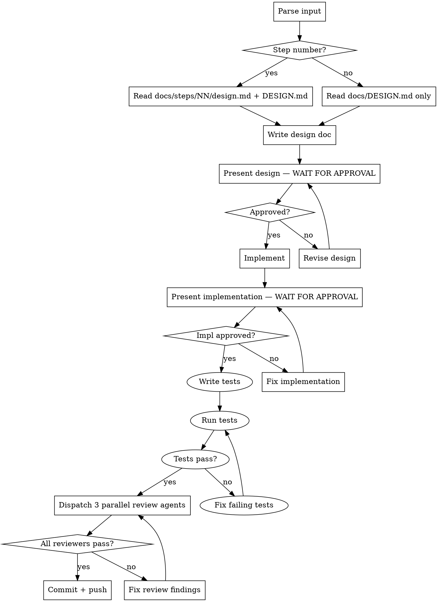

# code-gen

## Overview

Interactive code generation with three human-approval gates:
**Design → [approve] → Implement → [approve] → Test → Review (3 agents) → [approve] → Push**

Never skip a gate. Never push without tests passing and all three reviewers passing.

## Workflow



---

## Phase 1 — Design

### 1a. Read context
- If step number given: read `docs/DESIGN.md` roadmap entry + `docs/steps/NN-name/design.md` if it exists
- If free text: read `docs/DESIGN.md` stack + conventions sections

### 1b. Write design doc to `docs/steps/NN-name/design.md`

Cover all of these — skip none:

```markdown
## Task
What is being built (one sentence).

## Files to create
List every file with its full path.

## ScreenWrapper config
Which props: title / subtitle / form / footer / centered / scrollable / padded

## State approach
- Server data → TanStack Query (list the queries/mutations)
- Global UI → Zustand (list stores + actions)
- Local → useState (list which)
- Forms → React Hook Form + Zod schema

## Props drilling check
Max 2 levels. If deeper → Zustand. Confirm here.

## Navigation wiring
- Which navigator (stack/tab/drawer)
- Param list changes needed
- Screen registration

## Libraries used
Map each need to the correct lib (see Quick Reference)

## Dark/light mode
- Colors via: `useAppTheme()` hook
- Theme tokens used: (list: `colors.background`, `colors.text`, etc.)
- Any conditional styles: (describe or "none — tokens handle it")

## Commit message
`type(scope): description`
```

### 1c. Present and wait
Show the full design doc to the user. **Stop. Do not write a single source file until the user explicitly says "approved", "yes", "looks good", or equivalent. If they give feedback, revise and present again.**

---

## Phase 2 — Implementation

### 2a. Scaffold files

**Feature folder — always:**
```
src/features/{feature}/
  screens/       # XxxScreen.tsx
  components/    # feature-only components
  hooks/         # useXxx.ts
  store/         # xxxStore.ts
  api/           # xxx.api.ts
  types/         # xxx.types.ts
```

**NEVER at:** `src/screens/` ❌ · `src/stores/` ❌ · project root ❌

**Every screen — ScreenWrapper, never raw View:**
```tsx
import { ScreenWrapper } from '@/shared/components/ScreenWrapper';

export const ProfileScreen = () => (
  <ScreenWrapper title="Profile" headerRight={<EditButton />}>
    {/* content */}
  </ScreenWrapper>
);
```

**Every screen — theme tokens, never hardcoded colors:**
```tsx
const { colors, spacing, typography } = useAppTheme();

const styles = StyleSheet.create({
  container: { backgroundColor: colors.background },
  title:     { color: colors.text, ...typography.h2 },
  card:      { backgroundColor: colors.surface, padding: spacing.md },
});
```

Never: `color: '#333'` ❌ · `backgroundColor: 'white'` ❌ · `padding: 16` ❌

**Every Zustand store — devtools + named actions:**
```ts
export const useAuthStore = create<AuthStore>()(
  devtools(
    persist((set) => ({
      user: null,
      login: (user) => set({ user }, false, 'auth/login'),
      logout: () => set({ user: null }, false, 'auth/logout'),
    }), { name: 'auth-store', storage: mmkvStorage }),
    { name: 'AuthStore' }
  )
);
```

### 2b. Wire navigation
Update `src/app/navigation/types.ts` and the correct navigator.

### 2c. Present and wait
Show all created/modified files with a summary of what each does. **Stop. Do not dispatch review agents until the user explicitly approves. If they request changes, fix and present again.**

---

## Phase 3 — Tests

No reviewer sees untested code. Write and pass all relevant tests before dispatching reviewers.

### 3a. Write tests

| What was built | Tests to write |
|---|---|
| Zustand store | Unit: actions, selectors, initial state (`store.test.ts`) |
| Hook | Unit: return values, state changes (`useXxx.test.ts`) |
| Zod schema | Unit: valid + invalid inputs (`xxx.schema.test.ts`) |
| Screen | Component: renders title, shows loading/error states, key interactions (`XxxScreen.test.tsx`) |
| Utility function | Unit: all branches (`xxx.utils.test.ts`) |
| API function | Unit: correct endpoint, params, error handling (mock axios) |

Test files live next to the source file:
```
src/features/auth/screens/ProfileScreen.tsx
src/features/auth/screens/ProfileScreen.test.tsx   ← same folder
```

### 3b. Minimum test coverage per file

- **Store**: test every action + selector
- **Screen**: test render, loading state, error state, at least one user interaction
- **Hook**: test initial return value + state change after action
- **Schema**: test at least one valid case + one invalid case per field

### 3c. Run and fix

```bash
yarn test --watchAll=false
```

Fix every failing test before moving to reviewers. Do not pass failing tests to reviewers.

---

## Phase 4 — Review (3 parallel agents)


Dispatch all three at the same time using the Agent tool.

### Reviewer 1 — Conventions
Checks against `docs/DESIGN.md` rules:
- ScreenWrapper used (not SafeAreaView/View)
- Correct folder location
- Naming conventions (PascalCase screens, `use` prefix hooks, `Store` suffix)
- No props drilled > 2 levels
- Context never used alone (always + Zustand)
- All colors from `useAppTheme().colors` — no hardcoded hex/color names
- All spacing from `useAppTheme().spacing` — no hardcoded numbers
- All font styles from `useAppTheme().typography` — no hardcoded fontSize/fontWeight
- Dark mode verified: every color token has a dark variant in the theme

### Reviewer 2 — Architecture
- State split correct (Query vs Zustand vs useState vs RHF)
- No prop drilling violations
- Navigation types complete
- Zustand store has `devtools` middleware + named actions
- Add to `ReactotronConfig.ts` stores array if new store created

### Reviewer 3 — Code Quality
- TypeScript types are explicit (no implicit `any`)
- Error states handled (loading, error, empty)
- Image component is `react-native-fast-image`
- Dates use `date-fns`
- HTTP uses `axios` client (not `fetch`)
- No `console.log` left in code
- No hardcoded colors (`'#333'`, `'white'`, `'black'`) — must use `useAppTheme().colors`
- No hardcoded spacing numbers — must use `useAppTheme().spacing`

### Review gate
All three reviewers must pass. If any reviewer finds issues:
1. Fix all findings
2. Re-dispatch all three reviewers
3. Repeat until clean

---

## Phase 5 — Commit + Push

Only after all reviewers pass and user gives final approval:

```bash
git add src/ docs/steps/
git commit -m "feat(scope): description"
git push
```

Update `docs/steps/NN-name/implementation.md` with what was built before committing.

---

## Quick Reference — Library Choices

| Need | Use | Never |
|---|---|---|
| Screen root | `ScreenWrapper` | `View`, `SafeAreaView` |
| Images | `react-native-fast-image` | `Image` |
| Storage | `react-native-mmkv` | `AsyncStorage` |
| Secure storage | `react-native-keychain` | MMKV |
| Forms | React Hook Form + Zod | `useState` per field |
| Dates | `date-fns` | `moment`, manual format |
| HTTP | `axios` client | `fetch` |
| State — server | TanStack Query | `useEffect` fetch |
| State — global | Zustand + `devtools` | Context alone |
| Animations | Reanimated 3 | `Animated` API |
| Colors | `useAppTheme().colors` | hardcoded hex/names |
| Spacing | `useAppTheme().spacing` | hardcoded numbers |
| Typography | `useAppTheme().typography` | hardcoded fontSize/fontWeight |

## Critical Issues Checklist (review before every commit)

Before dispatching reviewers, confirm none of these are present:

| Issue | Check |
|---|---|
| Token refresh loop | `tokenQueue` clears on failure + calls `logout()` |
| Keychain survives uninstall | First-launch MMKV flag + `resetGenericPassword()` if new install |
| Firebase Analytics in dev | `setAnalyticsCollectionEnabled(!__DEV__)` at app init |
| Sentry enabled in dev | `enabled: !__DEV__` in Sentry config |
| OTA + native code change | Never — full release required |
| Sensitive data in MMKV | Auth tokens → keychain only |
| useEffect without cleanup | Every subscription/timer returns cleanup fn |
| Unhandled promise rejection | `try/catch` in all async effects, `onError` on all mutations |
| console.log left in code | Zero — ESLint `no-console` enforced |
| Hardcoded colors/spacing | Zero — `useAppTheme()` only |
| Missing ErrorBoundary | Every screen wrapped |
| Props drilled 3+ levels | Refactor to Zustand first |

---

## Red Flags — Stop Immediately

- Writing source files before design is approved
- Dispatching reviewers before implementation is approved
- Pushing before all 3 reviewers pass AND user gives final approval
- Using `SafeAreaView` or `View` as screen root
- Putting files in `src/screens/` or root
- Props drilled more than 2 levels without Zustand
- Hardcoded color, spacing, or font size anywhere — use `useAppTheme()`
- Dispatching reviewers before `yarn test` passes
- "Tests aren't needed for this small screen"
- "It's just a small change, I'll skip the review"
- "The user said yes to the design so I'll start pushing"
